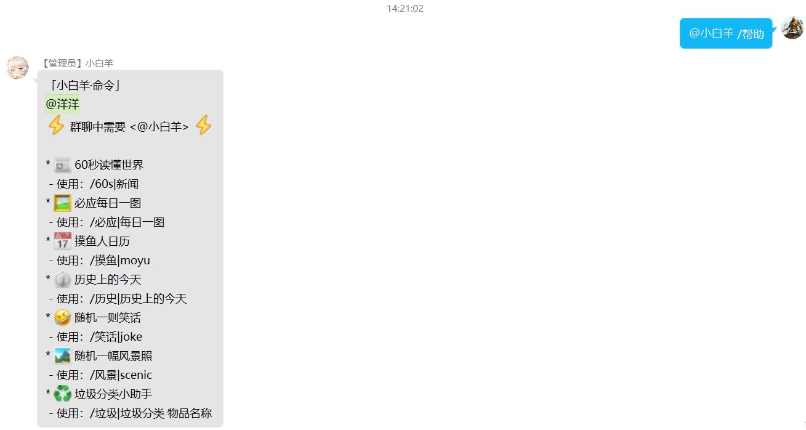
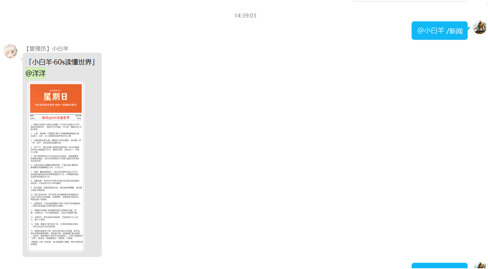
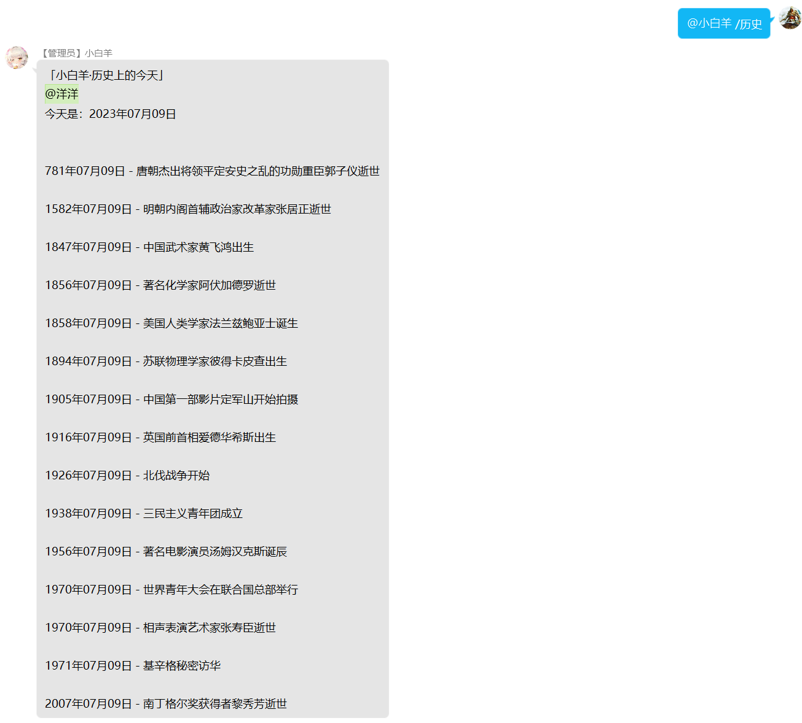
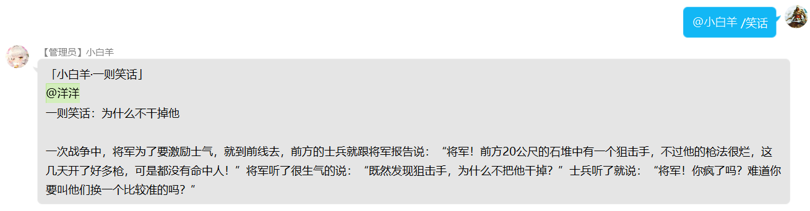
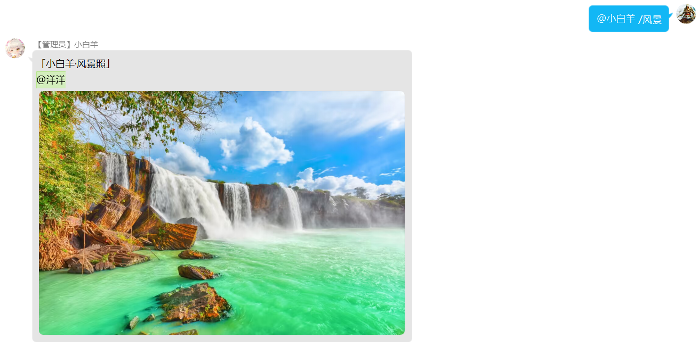
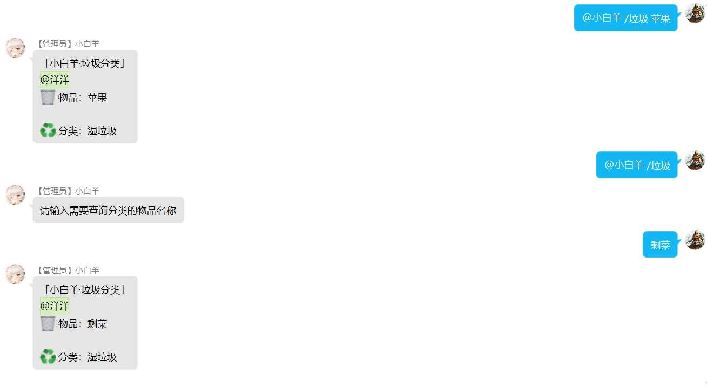

<div align="center">

# 🤖sheepBot

sheepBot 一个普通的QQ小助手，为你的QQ群提供一些便捷的微服务

[](https://github.com/zhy201810576/sheepBot/blob/main/LICENSE)
[](https://github.com/zhy201810576/sheepBot/releases/)
[](https://www.python.org/)
[](https://github.com/nonebot/nonebot2)
[](https://github.com/Mrs4s/go-cqhttp)
[](https://github.com/zhy201810576/sheepBot)

</div>

# 前言

此项目作为个人日常使用，由于只在自己的同好群里使用，所以功能不是很多。

此项目提供一个docker镜像：[grayzhao/sheepbot](https://hub.docker.com/r/grayzhao/sheepbot)

# 功能列表

- [x] [💡 命令帮助](sheepbot/src/plugins/help_desc)
- [x] [📰 60秒读懂世界](sheepbot/src/plugins/60s%20News)
- [x] [🖼 必应每日一图](sheepbot/src/plugins/bing_scenery)
- [x] [📅 摸鱼人日历](sheepbot/src/plugins/moyu_calendar)
- [x] [⏲ 历史上的今天](sheepbot/src/plugins/today_in_history)
- [x] [🤣 随机一则笑话](sheepbot/src/plugins/little_joke)
- [x] [🏞 随机一幅风景照](sheepbot/src/plugins/scenic_photography)
- [x] [♻ 垃圾分类小助手](sheepbot/src/plugins/waste_sorting)

# 部署方法

## 容器化部署

1. 在 Linux 服务器上部署，首先安装 docker 和 docker-compose:

    ```shell
    # 一键安装docker
    curl -fsSL https://get.docker.com | bash -s docker --mirror Aliyun
    
    # 查看docker版本
    docker -v
    
    # 设置开机启动
    systemctl enable docker
    
    # 启动
    systemctl start docker
    
    # 安装docker-compose
    pip3 install docker-compose
    
    # 查看docker-compose版本
    docker-compose --version
    ```

2. 下载[发行版](https://github.com/zhy201810576/sheepBot/releases/)或克隆本仓库：

    ```shell
    # 克隆本仓库
    git clone https://github.com/zhy201810576/sheepBot
    
    # 切换至仓库目录
    cd sheepBot
    ```

3. 按自己的需求修改`sheepBot/src/plugins`中各个功能插件的`config.py`中的配置参数

4. 安装`go-cqhttp`，相关教程可参考 [go-cqhttp官方文档](https://docs.go-cqhttp.org/guide/quick_start.html#%E4%BD%BF%E7%94%A8)，从 [release](https://github.com/Mrs4s/go-cqhttp/releases) 界面下载最新版本的`go-cqhttp`：

    | 支持平台 | 支持状况 |
    |-----------|:---:|
    | Windows     | ✔️ |
    | MacOS       | ✔️ |
    | UNIX, Linux | ✔️ |

    官方也提供`go-cqhttp`的 Docker 镜像，可参考 [使用Docker](https://docs.go-cqhttp.org/guide/docker.html#%E6%8B%89%E5%8F%96%E9%95%9C%E5%83%8F)
    
    > **P.S.** 需要配置反向WebSocket，修改 `config.yml` 文件中的 `universal: ws://your_websocket_universal.server` 为 `universal: ws://127.0.0.1:端口号/onebot/v11/ws/`，端口号10000~50000之间随机设置一个

5. 修改 `sheepBot/.env.dev` 配置文件 (在开发模式下运行)

    ```yaml
    # 配置 NoneBot 超级用户（哪些QQ可以管理该机器人）
    SUPERUSERS=["123456789]
    # 配置机器人的昵称，可以设置多个
    NICKNAME=["小白羊"]
    ```
    设置为**生产模式**需修改 `sheepBot/.env` 文件下的 `ENVIRONMENT=dev` 为 `ENVIRONMENT=prod`

    编写 `sheepBot/.env.prod`

    ```yaml
    # 配置 NoneBot 监听的 IP/主机名
    HOST=0.0.0.0
    # 配置 NoneBot 监听的端口
    PORT=8080
    # 配置 NoneBot 超级用户（哪些QQ可以管理该机器人）
    SUPERUSERS=["123456789"]
    # 配置机器人的昵称，可以设置多个
    NICKNAME=["小白羊"]
    # 配置命令起始字符 以"/"开头表示对机器人发指令
    COMMAND_START=["/"]
    ```
    
6. 创建 Docker 容器

    > docker run -p {ssh_port}:22 -p {ws_port}:8080 -v {sheepBot_path}:/app --name sheepBot grayzhao/sheepbot

    参数说明：
    
    > `ssh_port`： 可选 - SSH服务端口，以方便二次开发
 
    > `ws_port`：必填 - 必须与`go-cqhttp`的`config.yml`中设置的反向WebSocket端口号相同！！
    
    > `sheepBot_path`：必填 - 下载的`sheepBot`项目路径
   
7. docker-compose.yml
    ```yaml
    version: '3.5'
    services:
      sheepBot:
        image: grayzhao/sheepbot
        container_name: sheepBot
        volumes:
          # 下载的 sheepBot 项目路径
          - ${PWD}/sheepBot:/app
        ports:
          - 10022:22 # SSH服务端口
          - 10080:8080 # 必须与`go-cqhttp`的`config.yml`中设置的反向WebSocket端口号相同！！
        restart: unless-stopped
    ```


# 官方文档

如果在使用过程中遇到问题可以提 [issue](https://github.com/zhy201810576/sheepBot/issues)，或者查阅以下官方文档。

- [nonebot2 官方文档](https://v2.nonebot.dev/guide/)

- [go-cqhttp 官方文档](https://docs.go-cqhttp.org/guide/)

# 功能调用示例

图片中的内容是通过 API 获取的外部信息，仅作功能展示示例。

我们假设机器人昵称为 `小白羊` 。

> 💡 命令帮助 | `@小白羊 /帮助|help`



<br>

> 📰 60秒读懂世界| `@小白羊 /新闻|60s`



<br>

> 🖼 必应每日一图 | `@小白羊 /必应|每日一图`


<br>

> 📅 摸鱼人日历 | `@小白羊 /摸鱼|moyu`


<br>

> ⏲ 历史上的今天 | `@小白羊 /历史|历史上的今天`



<br>

> 🤣 随机一则笑话 | `@小白羊 /笑话|joke`



<br>

> 🏞 随机一幅风景照 | `@小白羊 /风景|scenic`



> ♻ 垃圾分类小助手 | `@小白羊 /垃圾|垃圾分类 物品名称`



<br>

# 开源许可

本项目使用 [Apache-2.0](https://choosealicense.com/licenses/apache-2.0/) 作为开源许可证。